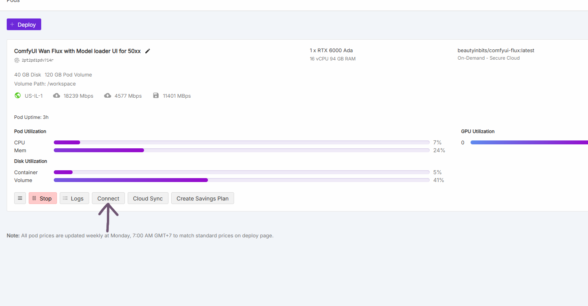
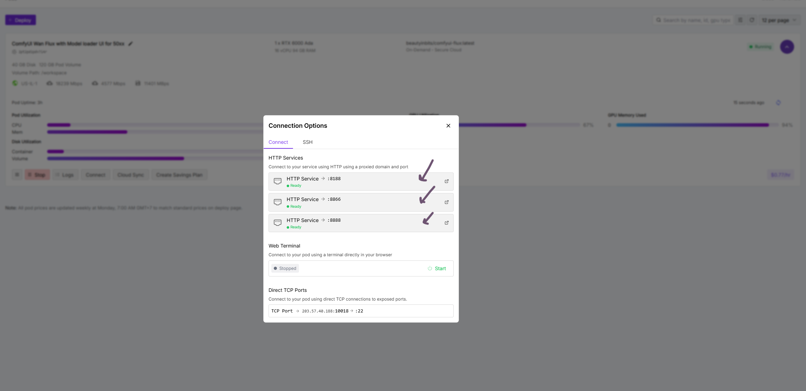
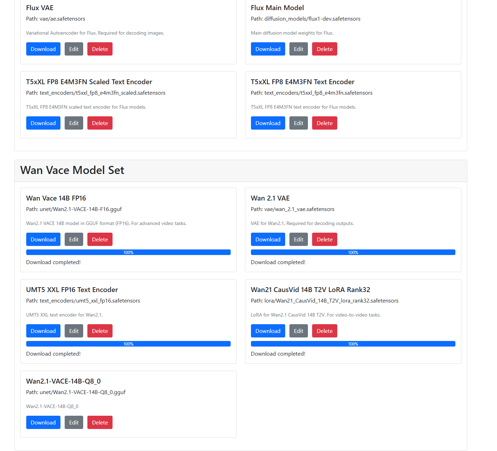
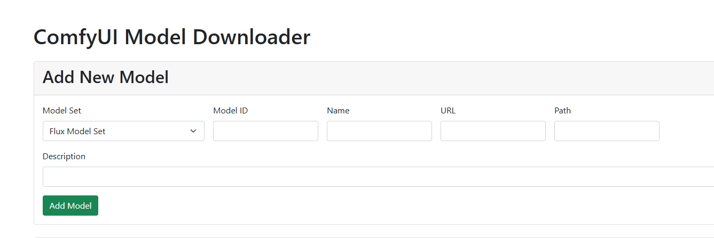

# RunPod ComfyUI Template User Guide

## Overview

This RunPod template provides a complete ComfyUI installation with Flux models, custom nodes, and an integrated model downloader. The template automatically sets up ComfyUI, installs dependencies, and provides a web interface for downloading AI models.

## Quick Start

### 1. Deploy the Template on RunPod

1. **Log in to RunPod** and navigate to your pod dashboard
2. **Create a new pod** using this custom template
3. **Select your preferred GPU** (recommended: RTX 50xx series, RTX 4090, A100, or H100 for Flux models)
4. **Set storage** to at least 50GB (recommended: 100GB+ for multiple models)
5. **Deploy the pod**

### 2. Access Your Services

Once your pod is running, you'll have access to four main services:

| Service              | Port | Purpose                                  |
| -------------------- | ---- | ---------------------------------------- |
| **ComfyUI**          | 8188 | Main AI image generation interface       |
| **Model Downloader** | 8866 | Web interface for downloading models     |
| **File Manager**     | 8765 | Browse and download ComfyUI output files |
| **JupyterLab**       | 8888 | File management and notebook environment |

**How to Access:**

1. **Easy Access**: Click the "Connect" button on your RunPod pod, then click the HTTP Service buttons for ports 8188, 8866, 8765, or 8888


_Step 1: Click the "Connect" button on your RunPod pod_


_Step 2: Click the HTTP Service buttons to access ComfyUI (8188), Model Downloader (8866), File Manager (8765), or JupyterLab (8888)_

2. **Direct URLs** (alternative):
   - ComfyUI: `https://[your-pod-id]-8188.proxy.runpod.net`
   - Model Downloader: `https://[your-pod-id]-8866.proxy.runpod.net`
   - File Manager: `https://[your-pod-id]-8765.proxy.runpod.net`
   - JupyterLab: `https://[your-pod-id]-8888.proxy.runpod.net`

## What's Included

### Pre-installed Custom Nodes

- **ComfyUI-VideoHelperSuite** - Video processing capabilities
- **civitai_comfy_nodes** - Integration with Civitai model repository
- **ComfyUI-KJNodes** - Additional utility nodes
- **ComfyUI_essentials** - Essential ComfyUI extensions
- **comfyui-art-venture** - Advanced artistic nodes
- **sdxl_prompt_styler** - Enhanced prompt styling
- **ComfyUI-Allor** - Additional image processing nodes
- **sigmas_tools_and_the_golden_scheduler** - Advanced sampling tools
- **rgthree-comfy** - UI improvements and utilities
- **ComfyUI-MultiGPU** - Multi-GPU support
- **ComfyUI-JDCN** - Additional utility nodes
- **ComfyUI-GGUF** - GGUF model format support
- **was-node-suite-comfyui** - Comprehensive node collection

### Pre-installed Dependencies

- **PyTorch 2.8.0** with CUDA 12.8.1 support
- **All ComfyUI requirements** and additional dependencies
- **gguf-node** for GGUF model support
- **imageio-ffmpeg** for video processing
- **All custom node dependencies**

## Using the Model Downloader

### Accessing the Model Downloader

1. Open your browser and go to: `https://[your-pod-id]-8866.proxy.runpod.net`
2. You'll see a web interface with available model categories


_Model Downloader web interface showing available model categories_

### Available Model Categories

- **Flux Models** - Complete Flux model set (text encoders, VAE, UNET)
- **WAN2.1 VACE Models** - WAN2.1 VACE 14B and 14B_Q8_0 models

### Adding Models Manually

You can also add additional models manually through the interface:


_Simplified interface for manually adding custom models - just enter the model name, download URL, and save path_

**To add a custom model:**

1. **Select Model Set** - Choose an existing category or create a new group
2. **Enter Model Name** - Descriptive name for the model (ID will be auto-generated)
3. **Provide Download URL** - Direct link to the model file
4. **Specify Save Path** - Where to save the file in ComfyUI models folder
5. **Add Description** (optional) - Brief description of the model
6. **Click Add Model**

#### Examples:

**Example 1: Adding a Checkpoint Model**

```
Model Set: flux (existing group)
Model Name: Realistic Vision XL
Download URL: https://civitai.com/api/download/models/130072
Save Path: checkpoints/realistic_vision_xl.safetensors
Description: High-quality realistic image generation model
```

**Example 2: Adding a LoRA Model**

```
Model Set: flux (existing group)
Model Name: Anime Style LoRA
Download URL: https://huggingface.co/user/model/resolve/main/anime_lora.safetensors
Save Path: loras/anime_style_lora.safetensors
Description: LoRA for anime-style image generation
```

**Example 3: Creating New Model Category**

```
Model Set: -- New Group --
New Group Name: SDXL Models
Model Name: SDXL Base 1.0
Download URL: https://huggingface.co/stabilityai/stable-diffusion-xl-base-1.0/resolve/main/sd_xl_base_1.0.safetensors
Save Path: checkpoints/sdxl_base_1.0.safetensors
Description: Stable Diffusion XL base model
```

#### Path Guidelines:

- **Checkpoints/Main Models**: `checkpoints/model_name.safetensors`
- **LoRA Models**: `loras/lora_name.safetensors`
- **VAE Models**: `vae/vae_name.safetensors`
- **Text Encoders**: `text_encoders/encoder_name.safetensors`
- **ControlNet**: `controlnet/controlnet_name.safetensors`
- **Upscalers**: `upscale_models/upscaler_name.pth`
- **GGUF Models**: `unet/model_name.gguf`

#### URL Requirements:

- Must be a **direct download link** to the model file
- Supported formats: `.safetensors`, `.ckpt`, `.pt`, `.pth`, `.gguf`
- For Hugging Face: Use `/resolve/main/` in the URL for direct download
- For Civitai: Use API download links when possible

#### Tips:

- **Model names** can contain spaces and special characters
- **Save paths** should not start with `/` or `\`
- **File extensions** in the path should match the actual model format
- **Descriptions** help identify model purposes and capabilities

_Note: Additional model categories (SDXL, SD 1.5, ControlNet, LoRA, Upscalers) can be added manually through the ComfyUI interface or by downloading directly to the model folders._

## Using the File Manager

### Accessing the File Manager

1. Open your browser and go to: `https://[your-pod-id]-8765.proxy.runpod.net`
2. You'll see a web interface for browsing ComfyUI output files

### Features

The File Manager provides comprehensive tools for managing your ComfyUI generated content:

#### File Browsing

- **Navigate folders** - Browse through the ComfyUI output directory structure
- **View file details** - See file sizes, modification dates, and types
- **Search capabilities** - Easily locate specific files and folders

#### Download Options

- **Individual files** - Download single images, videos, or other outputs
- **Folder downloads** - Download entire folders as ZIP archives
- **Batch downloads** - Select multiple files for download

#### File Management

- **Create folders** - Organize your outputs into custom directories
- **Delete files/folders** - Remove unwanted content (with confirmation)
- **Bulk operations** - Select multiple items for batch deletion

#### Storage Information

- **Disk usage** - Monitor total disk space and available storage
- **Output folder size** - Track how much space your outputs are using
- **File counts** - See total number of files in output directory

### Using the File Manager

#### Basic Navigation

1. **Browse folders** by clicking on folder names
2. **Use breadcrumbs** at the top to navigate back to parent directories
3. **Refresh** the view to see newly generated files

#### Downloading Files

1. **Single file**: Click the download button (📥) next to any file
2. **Folder as ZIP**: Click the ZIP download button for any folder
3. **Current folder**: Use the "Download Folder as ZIP" button at the top

#### Managing Files

1. **Create new folder**: Click "New Folder" button and enter a name
2. **Delete items**:
   - Select individual items using checkboxes
   - Use "Select All" to select everything
   - Click "Delete Selected" and confirm
3. **Organization**: Create folders to organize outputs by project, date, or type

#### Storage Monitoring

- View **real-time storage usage** in the information panel
- Monitor **available disk space** to prevent storage issues
- Track **total file counts** in your output directory

### Tips for File Management

#### Organization Best Practices

- **Create project folders** for different generation sessions
- **Use descriptive names** for folders (e.g., "portraits_2025", "landscapes_flux")
- **Regular cleanup** - Delete unwanted outputs to save space

#### Download Strategies

- **Batch downloads** - Select multiple files for efficient downloading
- **ZIP downloads** - Use folder ZIP downloads for large collections
- **Regular backups** - Download important outputs to local storage

#### Storage Management

- **Monitor disk usage** regularly through the storage panel
- **Clean up temp files** periodically
- **Archive old projects** by downloading and then deleting

### Integration with ComfyUI

The File Manager automatically displays all files generated by ComfyUI:

- **Images** - PNG, JPG, WebP files from image generation
- **Videos** - MP4, GIF files from video generation workflows
- **Animations** - Animated GIFs and video sequences
- **Previews** - Temporary preview files and intermediate outputs

Files appear in the manager immediately after generation, making it easy to download your creations without switching between services.

## Using ComfyUI

### Accessing ComfyUI

1. Open your browser and go to: `https://[your-pod-id]-8188.proxy.runpod.net`
2. ComfyUI interface will load with the default workflow

### Basic Workflow

1. **Load a workflow** or use the default text-to-image workflow
2. **Select your models** from the dropdown menus:
   - Checkpoint/UNET models
   - VAE models
   - Text encoders (for Flux)
3. **Enter your prompt** in the text input nodes
4. **Adjust settings** like resolution, steps, CFG scale
5. **Click "Queue Prompt"** to generate images

### Flux-Specific Usage

For Flux models, ensure you have:

- **Text Encoders**: T5xxl FP16 and CLIP L
- **VAE**: Flux VAE (ae.safetensors)
- **UNET**: Flux Dev or Schnell model

## File Structure

Your pod will have the following structure:

```
/workspace/
├── ComfyUI/                    # Main ComfyUI installation
│   ├── custom_nodes/          # All custom nodes
│   ├── models/                # Model storage
│   │   ├── checkpoints/       # Main model files
│   │   ├── text_encoders/     # Text encoders for Flux
│   │   ├── vae/              # VAE models
│   │   ├── loras/            # LoRA adaptations
│   │   ├── controlnet/       # ControlNet models
│   │   └── upscale_models/   # Upscaler models
│   └── output/               # Generated images
└── comfy_template/            # Template files
    ├── flux_install.sh       # Installation script
    ├── model_downloader.py   # Model download service
    ├── start_services.sh     # Service startup script
    └── templates/            # Web interface templates
```

## Manual Model Installation

If you prefer to install models manually:

### Via JupyterLab

1. Access JupyterLab at `https://[your-pod-id]-8888.proxy.runpod.net`
2. Navigate to `/workspace/ComfyUI/models/[category]/`
3. Upload model files directly

### Via Terminal

Use JupyterLab's terminal or SSH to download models:

```bash
cd /workspace/ComfyUI/models/checkpoints/
wget [model-url] -O [model-name.safetensors]
```

## Installing Additional Custom Nodes

### Using ComfyUI Manager

1. In ComfyUI, open the **Manager** (if available)
2. Browse and install additional custom nodes
3. Restart ComfyUI if required

### Manual Installation

1. Access JupyterLab terminal
2. Navigate to custom_nodes directory:
   ```bash
   cd /workspace/ComfyUI/custom_nodes/
   ```
3. Clone the repository:
   ```bash
   git clone [repository-url]
   ```
4. Install dependencies:
   ```bash
   cd [node-directory]
   pip install -r requirements.txt
   ```
5. Restart ComfyUI

## Installing SageAttention (Optional)

For enhanced attention mechanisms:

1. Access JupyterLab terminal
2. Navigate to the template directory:
   ```bash
   cd /workspace/comfy_template/
   ```
3. Run the installation script:
   ```bash
   ./install_sage_simple.bat
   ```

## Troubleshooting

### ComfyUI Won't Start

1. Check JupyterLab terminal for error messages
2. Ensure all models are properly downloaded
3. Restart the pod if necessary

### Models Not Appearing

1. Verify models are in correct directories
2. Refresh ComfyUI (F5)
3. Check model file formats (.safetensors, .ckpt, .pt)

### Out of Memory Errors

1. Use smaller batch sizes
2. Reduce image resolution
3. Use FP16 models instead of FP32
4. Enable model offloading in settings

### Connection Issues

1. Verify pod is running
2. Check port mappings (8188, 8866, 8765, 8888)
3. Clear browser cache
4. Try incognito/private browsing mode

## Performance Tips

### For Best Performance

1. **Use appropriate GPU**: RTX 50xx series, RTX 4090, A100, or H100 recommended
2. **Enable optimizations**: Use xformers, attention slicing
3. **Model selection**: Use FP16 models when possible
4. **Batch processing**: Generate multiple images efficiently
5. **Memory management**: Monitor VRAM usage

### Storage Management

1. **Regular cleanup**: Remove unused models
2. **Model organization**: Keep only needed models loaded
3. **Output management**: Regularly backup and clear output folder

## Advanced Features

### Multi-GPU Support

- **ComfyUI-MultiGPU** node is pre-installed
- Configure multiple GPUs for parallel processing

### Video Generation

- **VideoHelperSuite** provides video generation capabilities
- **FFmpeg** is included for video processing

### API Access

- ComfyUI provides REST API access
- Use for programmatic image generation
- API documentation available in ComfyUI interface

## Support and Updates

### Updating ComfyUI

The template automatically updates ComfyUI on startup. To disable:

1. Edit `/workspace/comfy_template/flux_install.sh`
2. Set `UPDATE_COMFY_UI=false`

### Getting Help

- **ComfyUI Documentation**: Available in the interface
- **Community Forums**: ComfyUI community support
- **GitHub Issues**: Report template-specific issues

## Security Notes

- **No authentication**: Services run without passwords by default
- **Private networks**: Use RunPod's private networking when possible
- **Model sources**: Only download models from trusted sources
- **Data persistence**: Models and outputs persist in `/workspace/`

---

**Happy generating! 🎨**

For questions or issues with this template, check the logs in JupyterLab terminal or contact support.
